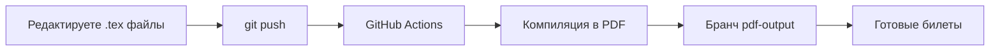

# 🎫 Шаблон экзаменационных билетов с автоматической сборкой

Автоматизированный шаблон для генерации экзаменационных билетов в формате PDF. Просто заполните текст — **GitHub Actions сам скомпилирует все билеты и опубликует PDF в отдельном бранче**.

---

## 🚀 Как это работает

1. Вы редактируете `.tex`-файл в бранче `main`
2. Делаете `git push`
3. GitHub Actions автоматически:
   - Устанавливает TeX Live
   - Компилирует **все** `.tex` → `.pdf`
   - Загружает результаты в бранч `pdf-output`
4. Готовые PDF доступны в [ветке `pdf-output`](../../tree/pdf-output)