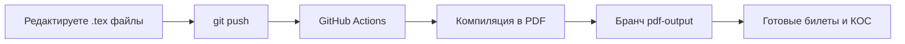

# 🎫 Шаблон экзаменационных билетов, КОС и Рабочей программы с автоматической сборкой

Автоматизированный шаблон для генерации экзаменационных билетов, КОС и Рабочей программы в формате PDF. Просто заполните текст — **GitHub Actions сам скомпилирует всё и опубликует PDF в отдельном бранче**.

---

## 🚀 Как это работает

1. Вы редактируете `.tex`-файл в бранче `main`
2. Делаете `git push`
3. GitHub Actions автоматически:
   - Устанавливает TeX Live (чтобы не думать над зависимостями, ставится full - он большой, поэтому весь процесс занимает много времени (минут 10-15 примерно))
   - Компилирует **все** `.tex` → `.pdf`
   - Загружает результаты в бранч `pdf-output`
4. Готовые PDF доступны в [ветке `pdf-output`](../../tree/pdf-output)

## Текущая структура проекта

Следующие файлы являются общими источниками для всех трёх типов документов:

- competencies.txt - ОК и ПК
- evaluation.txt - Критерии оценки
- parameters.txt - Однострочные переменные
- ymet.txt - список того, что нужно знать
- znat.txt - список того, что нужно уметь

TeX-файлы:

- exam_tickets.tex - Билеты
- kos.tex - КОС
- program.tex - Рабочая программа

Готовность шаблонов (TeX-файлов) - черновая, большая часть разметки и стилей ещё не настроены! Не выделены все параметры и переменные в тхт-файлы.